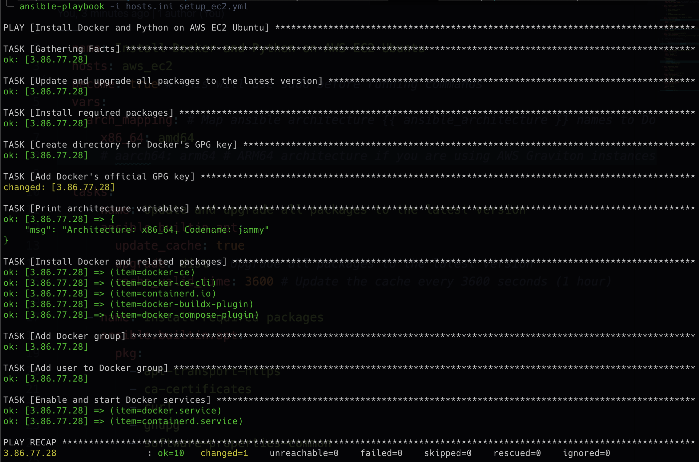

# Ansible Config

Ansible help us to automate the installation of dependencies on an Ubuntu AWS EC2 instance. Ansible uses SSH to connect to your remote hosts and execute tasks defined in playbooks. Since we connect to the instance with a `.pem` file, we'll just need to reference this key within my Ansible configuration.

Here's a high-level overview of the steps we would follow to use Ansible:

## 1. Install Ansible

On your local machine or on a control machine that has access to the EC2 instance, you'll need to have Ansible installed.

```sh
sudo apt update
sudo apt install ansible -y
```

## 2. Create an Inventory File

Create an inventory file where you define your EC2 instance details. This can be a simple `.ini` formatted file, or you can use Ansible's dynamic inventory for AWS.

For example, your inventory `hosts.ini` might look like this:

```ini
[aws_ec2]
your_ec2_public_ip ansible_user=ubuntu ansible_ssh_private_key_file=/path/to/your-key.pem
```

## 3. Check my Ansible Playbook

We have a playbook that defines the tasks to be executed on the remote host. This playbook will replicate the commands in my `aws_startup_installation.sh` script.

Go check the playbook at `ansible/setup_ec2.yml` that installs Docker and Python:

## 4. Run the Ansible Playbook

With the inventory and playbook defined, you can run the playbook with the following command:

```sh
ansible-playbook -i hosts.ini setup_ec2.yml
```

This will execute the defined tasks on the specified hosts in our inventory. It should look like this:



## 5. Configure Ansible for Remote Key-Based Authentication

Make sure the Ansible configuration is set up to use the `.pem` file for SSH connections. This is done in the inventory file as shown above. Alternatively, you can specify SSH options using command-line flags or in an Ansible configuration file.

## Additional Notes

- Ensure the `.pem` file's permissions are correctly set to `400` for security.
- Make sure the security group attached to your EC2 instance allows SSH connections.
- You can use roles in Ansible to organize your tasks better and reuse code across multiple playbooks.

Using Ansible greatly simplifies the management of our cloud infrastructure by automating these types of operations.
